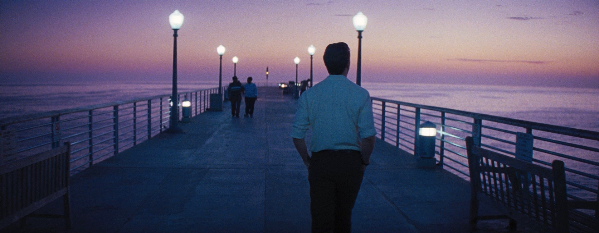
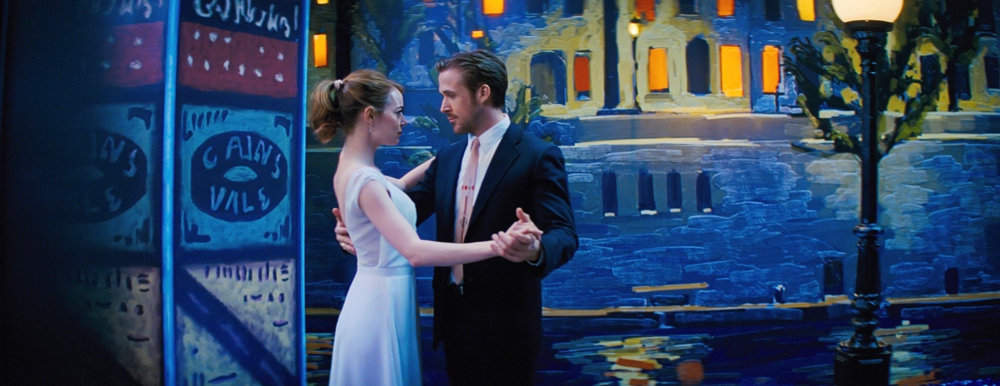
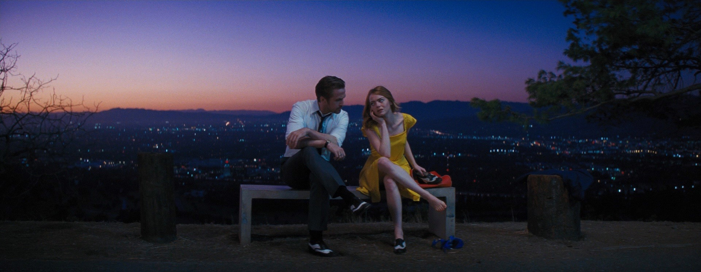

---
output:
  md_document:
    variant: gfm
---

# Palettes inspired by "La La Land"

I think *La La Land*'s use of color is breathtakingly beautiful, so I made an R package of palettes based on stills from the film. I used a combination of online image color pickers and Susie Lu's [Viz Palette](https://projects.susielu.com/viz-palette) to build them.


```{r echo=FALSE}
knitr::opts_chunk$set(fig.width=10, fig.height=2.3) 
```

## Installing and loading the package:

```{r}
devtools::install_github("simranvatsa/lalaland")
library(lalaland)
```

***

## The functions:

`show_lll_palette(name, n)`: prints the selected palette/subsection of palette as an image

`lll_palette(name, n)`: generates a vector containing hex codes for the the selected palette/subsection of palette

`lalaland_palettes`: named list containing all palettes

***
<br/>

***

## California:


```{r}
show_lll_palette("California")
```

***
<br/>

***

## City Of Stars #1:



```{r}
show_lll_palette("CityOfStars1")
```

***
<br/>

***

## City Of Stars #2:


```{r}
show_lll_palette("CityOfStars2")
```

***
<br/>

***

## Epilogue #1:



```{r}
show_lll_palette("Epilogue1")
```

***
<br/>

***

## Epilogue #2:


```{r}
show_lll_palette("Epilogue2")
```

***
<br/>

***

## LighthouseCafe:


```{r}
show_lll_palette("LighthouseCafe")
```

***
<br/>

***

## LovelyNight:



```{r}
show_lll_palette("LovelyNight")
```


***
<br/>

***

## Sebs:


```{r}
show_lll_palette("Sebs")
```

***
<br/>

***

## Summer:


```{r}
show_lll_palette("Summer")
```

***
<br/>

***

## Traffic:


```{r}
show_lll_palette("Traffic")
```

***
<br/>

***


## Using the palettes!

```{r, fig.width=6.5, fig.height=4.5}
library(ggplot2)

ggplot(iris, aes(x = Sepal.Length, y = Petal.Length, color = Species)) +
  geom_point() +
  scale_color_manual(values = lll_palette("CityOfStars1", c(2,3,4))) +
  theme_minimal() +
  labs(title = "Sepal and petal lengths for the iris dataset, colored by species")

ggplot(diamonds[diamonds$carat < 3, ], aes(x = carat, fill = cut)) +
  geom_histogram(bins = 20) +
  scale_fill_manual(values = lll_palette("Sebs")) +
  theme_minimal() +
  labs(title = "Distribution of carat values of diamonds")

ggplot(mpg, aes(x = class, fill = as.factor(cyl))) +
  geom_bar() +
  scale_fill_manual(values = lll_palette("LighthouseCafe", c(1,3,2,4))) +
  theme_minimal() +
  labs("Number of cars by class and cylinders in the mpg dataset")
  
```
